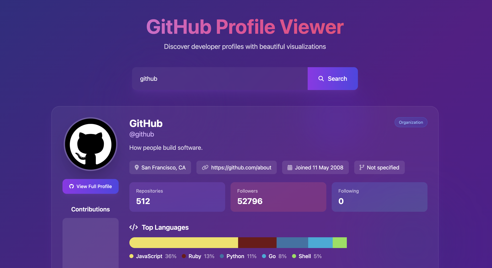

# GitHub Profile Viewer

> A beautiful, interactive dashboard to explore GitHub profiles with stunning visualizations and animations.



## 🚀 Live Demo

[View it on GitHub Pages](https://sagartiwari.net/github/)

## ✨ Features

* **Animated UI**: Smooth gradient backgrounds, floating elements, and fade-in/slide-up effects
* **Profile Overview**: Displays avatar, name, username, bio, company, location, website, and join date
* **Stats & Badges**: Shows repos, followers, following counts and custom badges
* **Contribution Calendar**: Visualizes daily commits with a responsive GitHub calendar
* **Repository Showcase**: Highlights top repositories with sorting by stars, forks, and updates
* **Language Analytics**: Interactive bar showing top languages used, with color-coded labels
* **Responsive Design**: Fully mobile‑friendly layout powered by Tailwind CSS
* **Error & Loading States**: User-friendly feedback when fetching data or on network errors

## 🛠️ Technologies

* **HTML5** & **Tailwind CSS** for structure and styling
* **JavaScript (ES6)** for API calls and DOM manipulation
* GitHub Calendar for contributions view
* **Font Awesome** for icons

## 🔧 Installation & Setup

1. **Clone the repo**

   ```bash
   git clone https://github.com/sagartiwari-net/GitHub-Profile-Viewer.git
   cd GitHub-Profile-Viewer
   ```

2. **Open locally**

   * Simply open `index.html` in your browser
   * Or serve via a live server:

     ```bash
     npm install -g serve
     serve .
     ```

3. **Usage**

   * Enter a GitHub username in the search field and hit **Search**
   * View profile details, contributions, and repository analytics
   * Click **View Full Profile** to open the GitHub page

## 📦 Deployment

* Host on [GitHub Pages](https://pages.github.com/) by pushing to `gh-pages` branch
* Or deploy via Netlify, Vercel, or any static site host

## 🤝 Contributing

Contributions are welcome! To get started:

1. Fork this repository
2. Create a feature branch (`git checkout -b feature/YourFeature`)
3. Commit your changes (`git commit -m 'Add YourFeature'`)
4. Push to the branch (`git push origin feature/YourFeature`)
5. Open a pull request

## 📝 License

This project is licensed under the MIT License. See the [LICENSE](LICENSE) file for details.

---

*Built with ♥️ and JavaScript by [Your Name](https://github.com/<sagartiwari-net>)*
